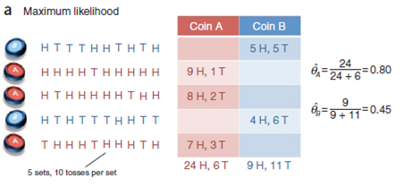
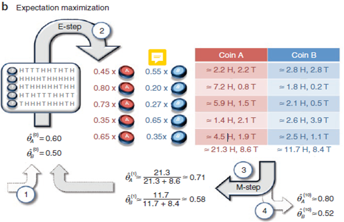
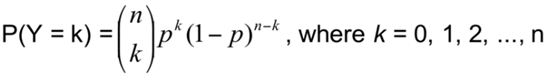
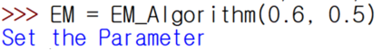
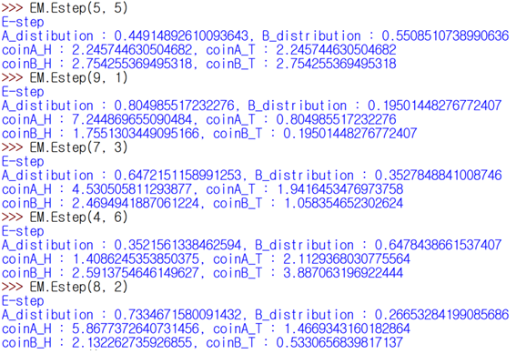
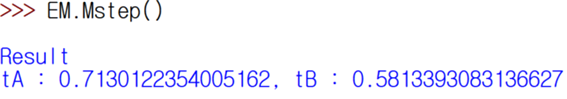
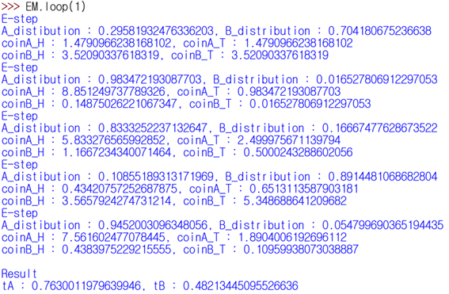
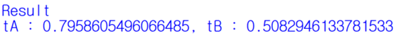

# Expectation Maximization

 <h4>들어가며..</h4>
 생물학에서 데이터를 이용하여  통계를 낼 때는 매개 변수를 통하여 데이터를 관측 및 예측하는 방법을 주로 사용한다. 그러나 완전하지 않은 데이터가 통계학적 모델을 통하여 학습이 될 경우 이는 데이터의 신뢰성에 큰 영향을 미치게 된다. 이 때, Expectation Maximization(기댓값 최대화) 알고리즘을 적용한다면 불완전한 데이터를 통해서도 통계학적 모델을 적용하여 신뢰성이 높은 데이터를 예측할 수 있다.
 
 <h4>EM 알고리즘</h4>
 
 Nature Biotechnology의 What is the expectation maximization(Chuong B Do & Serafim Batzoglou, 2008)에서는 동전을 던지는 문제를 통하여 Expectation Maximization 알고리즘에 대하여 설명을 하고 있다. 만약 동전을 던졌을 때 각 동전의 앞면이 나올 확률을 θ(A), θ(B)라고 정의한다면 각각
.png)와 .png)로 표현할 수 있다.

(A or B 동전의 앞면이 나온 횟수 / A or B 동전을 던진 전체 횟수)

 위의 그림과 같이 우리가 동전을 던지면서 A와 B 동전 각각의 경우에 대하여 어느 동전에서 앞면(H)과 뒷면(T)이 나왔는지에 대한 횟수를 기록해 두었다면 각 동전을 던졌을 때 앞면이 나올 확률을 쉽게 구할 수 있을 것이다.

 하지만 앞면과 뒷면이 나왔을 때의 결과만을 알고 있으며 A와 B 중 어느 동전의 결과인지를 알 수 없다면 우리는 A 동전과 B 동전의 각각 앞면이 나올 경우의 수에 대하여 통계를 내는 일은 힘들게 된다. 이 때 Expectiation Maximization 알고리즘을 이용한다면 어느 동전에서 나온 결과인지를 모르더라도 근삿값을 추측할 수 있게 된다.
 
 
 
 위의 그림은 같이 동전을 던졌을 때 결과는 알고 있지만 이 결과가 어느 동전을 통해서 추출 된 결과인지 알 수가 없을 때 Expectation Maximization 알고리즘을 통하여 각 동전 A와 B에서 앞면이 나올 확률을 추측하는 과정을 나타내고 있다.
 Expectation Maximization 알고리즘은 크게 4가지의 단계로 구분이 된다.
 
① 초기값 설정
 A 동전과 B 동전에서 각각 앞면이 나올 확률을 설정한다. 이는 하이퍼 파라메타로 가장 보통의 통계에 근거하여 선정하는 것이 올바른 값으로 수렴할 확률이 가장 높다. 현재 실험에서는 동전을 던져서 앞면이 나올 확률이므로 0.5에 근접한 값을 초기값으로 설정하였다.

② E-step
 E-step에서는 주어진 결과를 기반으로 이진확률변수를 계산하여 각 동전에서 앞면이 나올 확률을 계산한다. 이진확률변수는 다음과 같이 계산된다.
 
 
 
③ M-step
 E-step에서 계산 된 A와 B 동전에 대한 결과 값을 모두 합한 후 앞면이 나올 확률을 계산한다. 이를 통하여 초기 파라메타 값인 θ(A), θ(B)를 모두 업데이트한다.
 
④ Algorithm Converge
 E-step과 M-step을 계속하여 반복하여 나간다. 이 반복되는 과정을 통하여 θ(A), θ(B) 값은 계속하여 업데이트 된다. 그림에서는 10번을 반복하게 되는데 이 때의 결과 값은 각각 θ(Expect_A)=0.80 θ(Expect_B)=0.52로써 실제 결과 값인 θ(A)=0.80, θ(B)=0.45와 거의 유사하다.
 
 <h4>EM 구현</h4>
 
 
 
 EM_Algorithm 클래스의 인스턴스를 생성함과 동시에 초기 값(동전 A와 B의 앞면이 나올 확률)을 설정하여준다.
 
 
 
 E-step을 수행하는 단계로써 앞면이 나오는 경우의 수(H)와 뒷면이 나오는 경우의 수(T)을 함께 파라메타로 넘겨준다. 이를 통하여 A와 B의 이진확률변수를 계산한다.  이후 계산 된 이진확률변수를 통하여 각 동전 A와 B에서 앞면과 뒷면이 나올 확률을 계산한다.
 
 
 
 수행한 결과 값을 통하여 동전 각각의 앞면이 나올 확률인 θ(A), θ(B) 값을 업데이트한다. 현재 1회의 loop를 실행한 결과 초기 파라메타 θ(A)=0.6, θ(B)=0.5에서 θ(A)=0.71, θ(B)=0.58로 각각 업데이트 된 것을 확인할 수 있다.
 
 
 
 loop 함수에서는 입력 된 H와 T 값을 기반으로 반복을 통하여 파라메타의 업데이트가 쉽게 할 수 있도록 구현하였다. 첫 번째 M-step을 실행한 이후 두 번째 이후부터는 loop 함수를 호출하고 반복할 횟수를 파라메타로 넘겨주면 자동으로 E-step을 수행하며 n번만큼의 M-step을 수행한다. 위의 결과는 최초 1회의 루프 이후 1회의 루프를 더 수행하여 업데이트 된 θ(A2), θ(B2)의 값이다.
 
 
 
 1회 갱신 된 파라메타 값에서 9회를 다시 반복 실행하여 업데이트 된 결과 값이다. 이러한 과정을 반복함으로써 실제 값과 근사하는 결과 값을 도출해낼 수 있다.
 
 <h4>정리</h4>
 
 EM 알고리즘은 쉽고 간단하며 효율적으로 모델의 파라메타를 학습할 수 있다. 이러한 특성을 통하여 기계 학습과 컴퓨터 비전의 데이터 클러스터링 등에 사용이 된다. 
 
 <h4>REFERENCE></h4>
 
 위키피디아 [기댓값 최대화 알고리즘](https://ko.wikipedia.org/wiki/기댓값_최대화_알고리즘)
 
 [What is the expectation maximization(Chuong B Do & Serafim Batzoglou, 2008) - Nature Biotechnology](https://www.nature.com/articles/nbt1406)
